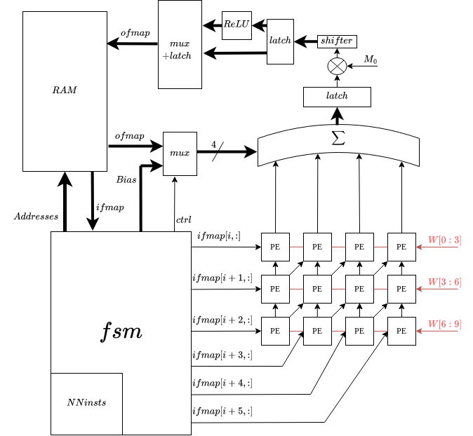
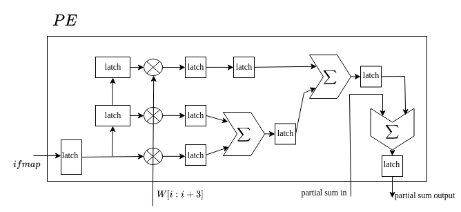
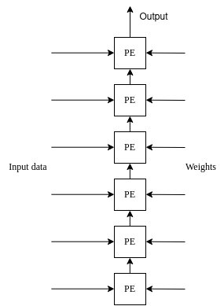

# CNN - FC accelerator fpga

This is a basic CNN (convolutional neural network) and FC (Fully connected layer) accelerator written in SV. It is generic, as it wasn't designed for any specific fpga target.    

It is 36 times faster than a single MAC unit. 

We have a .ipynb script that transforms the TensorFlow-trained model into the instructions and memory initializers required by the accelerator. We utilize TFLite for quantization of the weights and input to `int8`, following a similar approach to that of https://coral.ai/products/.

There is an MNIST classifier example available. You can find the tutorial below.
## Architecture   

For the CNN accelerator, the core component is the MAC array. It consists of a 3x4 array in which each processing element (PE) can perform 3 multiplications simultaneously.

It uses Row Stationary dataflow, as described in https://eyeriss.mit.edu/. In this taxonomy, weights are shared in each row, and input data is shared diagonally.

The RAM will always consist of two parts: the input feature map (ifmap) and the output feature map (ofmap). These two maps are always associated with a specific layer of the neural network. For the next layer, the current ofmap becomes the next ifmap.

Every column of the MAC array computes the dot product between the kernel and ifmap. This means that four kernel dot products are written in RAM simultaneously. Meanwhile, the MAC array requires the usage of six input feature maps concurrently.

After applying each filter over the ifmap, the ReLU activation function is applied. For classification purposes, the softmax function is not necessary, as the maximum output value will be the prediction.

    

The adders in the processing elements (PE) are arranged in a manner that maximizes the pipeline frequency operation.

    

Although we could utilize the hardware dedicated for the CNN accelerator, a separate hardware accelerator was designed specifically for the fully connected (FC) layer. Since we cannot exploit spatial properties in the case of FC as we do with the MAC array, a simple linear array of MAC units was designed. The main difference from the MAC 2D array, besides the number of elements, is that weights are continuously sent as each neuron has different weights.

In the same way, ReLU is applied for each neuron. 

The FC accelerator core unit consists of a linear array of 6 processing elements (PEs).

    

## Quantization

Weights and data are quantized to `int8`, which helps save memory storage. Quantization is performed using TFLite, based on the method described in this paper: https://arxiv.org/abs/1712.05877.

The relation between the quantized and real number is:

$$
r = S(q - z)
$$

where $q$ is the quantized (`int8`), $r$ is the real number (`float32`) and $S; z$ are constants.

As described in the paper, after every layer, a multiplication and a division are required to convert the quantized values back to real numbers. This operation can be decomposed into $M = 2^{-n}M_0$, where $M_0$ in the interval $[0.5,1)$. Shift operations consume minimal hardware resources, so the majority of the hardware is dedicated to multiplication operations. $M_0$ is estimated in the .ipynb script.

## MNIST classification example

The file `converter.ipynb` contains a small example for MNIST classification. In the last cell, the function `convert_model` is called. This function generates the memory initalization files in the `./sim` directory. Then, `main.sv` is used as the top module in a hardware simulation to obtain the results, which can be found in the RAM called memory within the memory_instance module.
The Questa simulator was used, but any other simulator could be used as well.

In the example provided in `converter.ipynb`, the 10-output starts at address 0x2046. 

